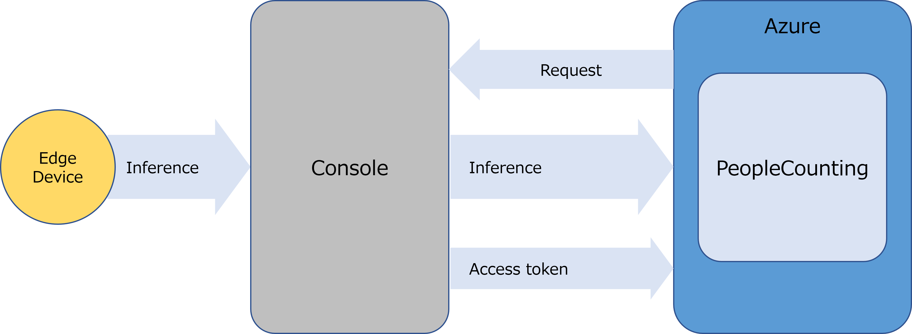

# 「**PeopleCounting**」 チュートリアル

## コンテンツ <!-- omit in toc -->

- [概要](#概要)
  - [「**PeopleCounting**」の構成](#peoplecountingの構成)
- [前提条件](#前提条件)
- [「**PeopleCounting**」の画面構成](#peoplecounting画面構成)
- [「**PeopleCounting**」の使用方法](#peoplecountingの使用方法)
  - [1. Home画面を表示する](#1-home画面を表示する)
  - [2. 通知を作成する](#2-通知を作成する)
  - [3. エッジAIデバイスでの推論を開始する](#3-エッジaiデバイスでの推論を開始する)
  - [4. 人数カウント結果をモニタリングする](#4-人数カウント結果をモニタリングする)
  - [5. 通知内容を確認する](#5-通知内容を確認する)
- [制限事項](#制限事項)

## 概要

「**PeopleCounting**」は、AIによる物体検出を利用した人数カウントシステムのサンプルです。 
このアプリケーションのUI上で下記の機能を提供します。

- 人数カウント結果に対する通知の設定
- 人数カウント結果のモニタリング

### 「**PeopleCounting**」の構成

Azureにデプロイされた「**PeopleCounting**」は、AITRIOS&trade;の「**Console**」(以下、「**Console**」)のAPIを利用してエッジAIデバイスの制御を行います。 
エッジAIデバイスが撮影した画像と推論結果は、「**Console**」にアップロードされた後、「**PeopleCounting**」に通知されます。 

## 前提条件

「**PeopleCounting**」のアプリケーションが、テナント上にデプロイ済みであること。 
アプリケーションのデプロイについては、[こちら](../deploy/README_ja.md)を参照してください。

## 「**PeopleCounting**」の画面構成

このアプリケーションは、下記の2つの画面で構成されます。 
各画面は、画面左のタブを選択することで切り替え可能です。

| 画面 | 使用用途 |
| ---- | ---- |
| Home画面 | エッジAIデバイスの制御と通知の設定を行います。 |
| Visualization画面 | 人数カウント状況および、主要な情報を示すダッシュボードです。 |

## 「**PeopleCounting**」の使用方法

### 1. Home画面を表示する

- 画面左の[**Home**]タブを選択し、Home画面を表示する

  Home画面では、2つのテーブルリストによって必要な設定を行います。
  | テーブル名 | 使用用途 |
  | ---- | ---- |
  | [**Device List**] | 「**Console**」に登録されているエッジAIデバイスの一覧を表示し、推論の開始・停止を行います。 |
  | [**Notification List**] | 登録された通知の一覧を表示し、新規作成・更新・削除を行います。 |

### 2. 通知を作成する

- [**Notification List**]の[**+**]ボタンを選択する
- [**Device**]のプルダウンから、利用するエッジAIデバイスを選択する
- [**Threshold**]のテキストボックスに、通知条件(人数)を入力する
- [**Condition**]のプルダウンから、通知条件(以上/以下)を選択する
- [**Title**]のテキストボックスに、通知タイトルを入力する
- [**Content**]のテキストボックスに、通知内容を入力する
- [**Method**]のプルダウンから、通知方法を選択する
- 作成した通知の[**+**]ボタンを選択する

### 3. エッジAIデバイスでの推論を開始する

- [**Device List**]から、利用するエッジAIデバイスを選択する
- [**▶**]ボタンを選択する

  各表示パーツの機能は下記のとおりです。
  | 表示パーツ | 機能説明 |
  | ---- | ---- |
  | [**▶**]ボタン | 推論を開始します。 |
  | [**■**]ボタン | 推論を停止します。 |
  | [**Refresh**]ボタン| Device Listを更新します。 |

### 4. 人数カウント結果をモニタリングする

- 画面左の[**Dashboard**]タブを選択し、Dashboard画面を表示する
- [**Select Device**]のプルダウンから、利用するエッジAIデバイスを選択する

選択したデバイスにおいて人数カウントした結果がチャートに表示されます。

### 5. 通知内容を確認する

- [**Notification**]からAzure SignalRに送られた通知内容を確認する

## 制限事項

- なし
